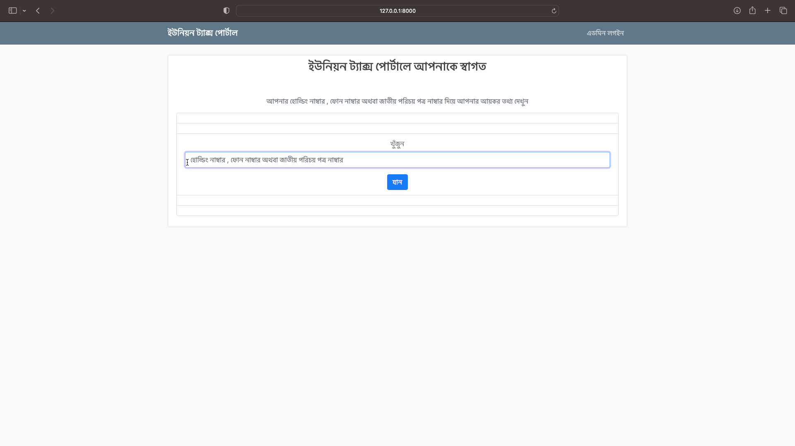
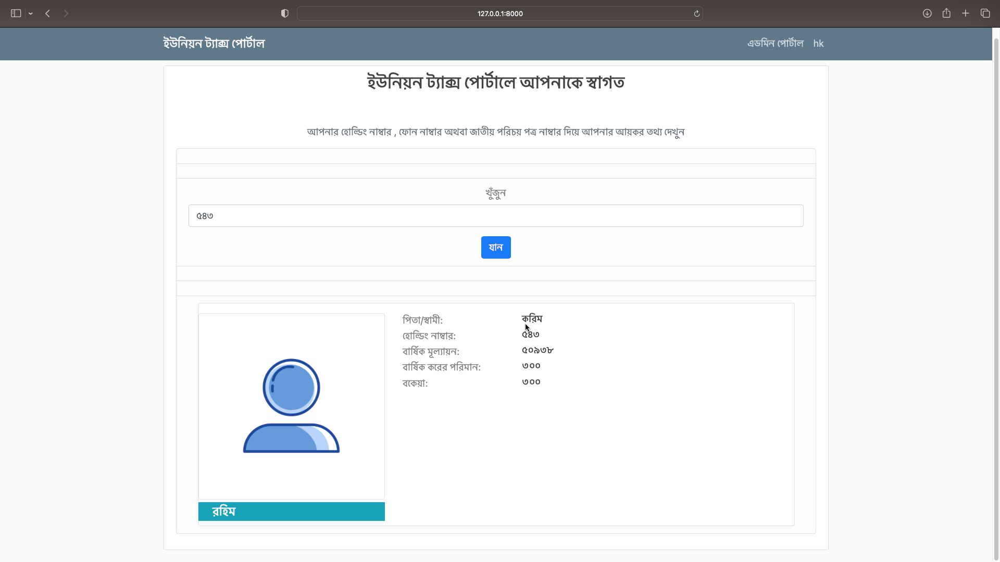
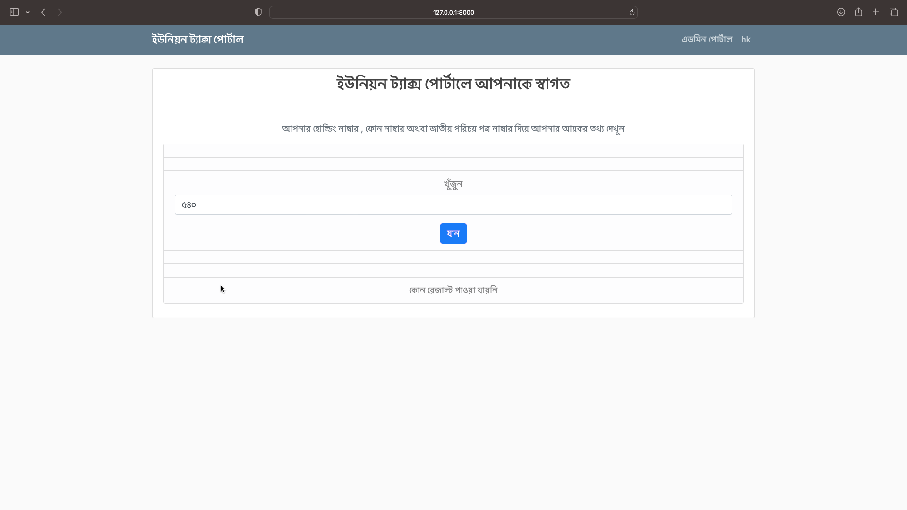
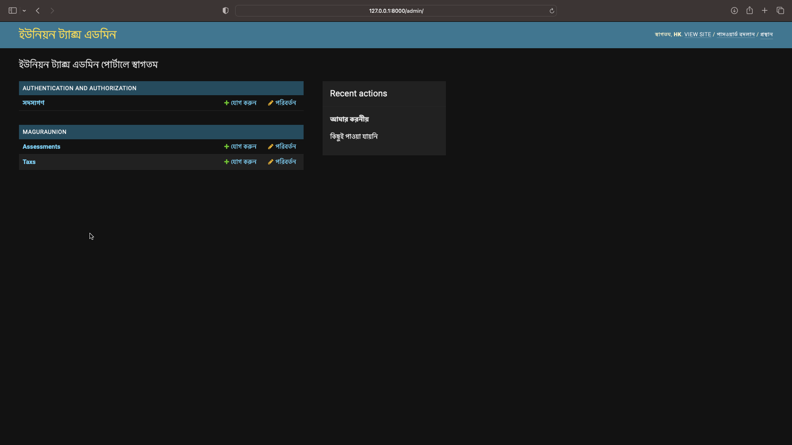
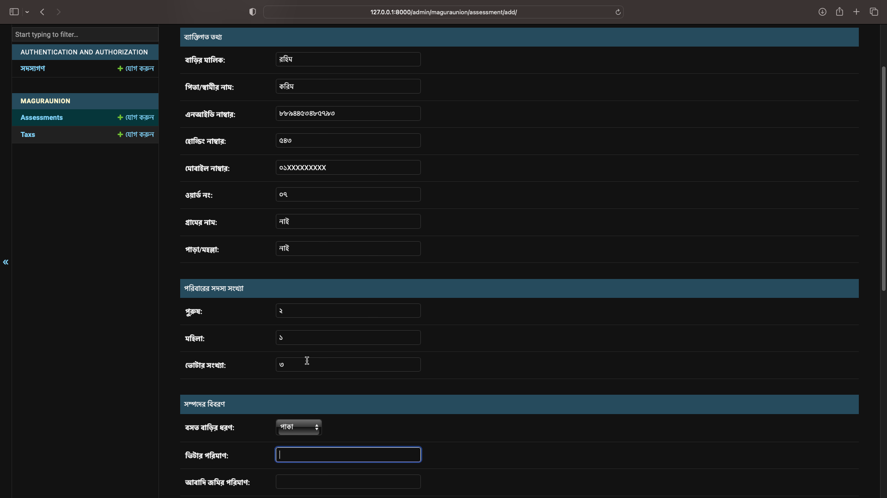
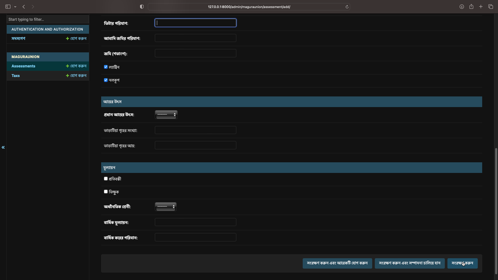
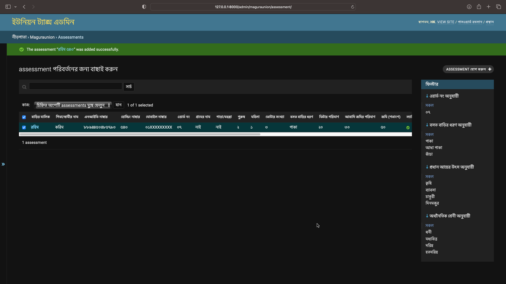
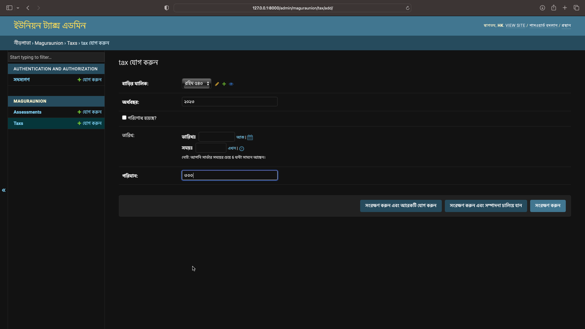
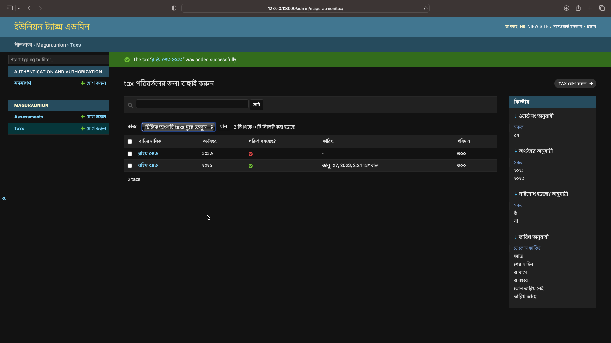

# UnionTaxManage
This is a project based on Django framework. It is mainly for a union digital center. The digitalization of tax management system, based on the requirements of the customer. Some features are missing in purpose.

# Overview
The homepage of the website shows welcome message to viewers. Then user can search for tax data. Admin can login to admin panel. Then admin can add taxpayer data. Initiate tax payment year.

The django admin panel is customized to build the project.

## Homepage
Homepage contains the menu bar and a search field to search information.

Any user can view tax info by giving valid info

Otherwise no data is shown

## Admin Panel
Admin can view all the database information and admin has a dashboard to manage,add,delete,edit all the data

Admin can add tax payer information

Admin manage,filter, search payer info

Also initiate tax year for users

Admin can manage tax amounts and other data

# Features

- [x] Admin Login
- [x] Admin can add,remove,edit tax payer information
- [] Tax is imposed yearly
- [] Admin can send text message to cell phone number of the tax payers
- [x] Admin can view status of the tax payment for any user
- [] Admin can print any data needed in excel format,generate pdf,csv
- [x] Admin can search and filter tax payers data using id,name or anything associate with payers
- [x] In the front website viewers only see a page to search for the tax information using phone number or NID number

# Frameworks used
- Django
- BootStrap
